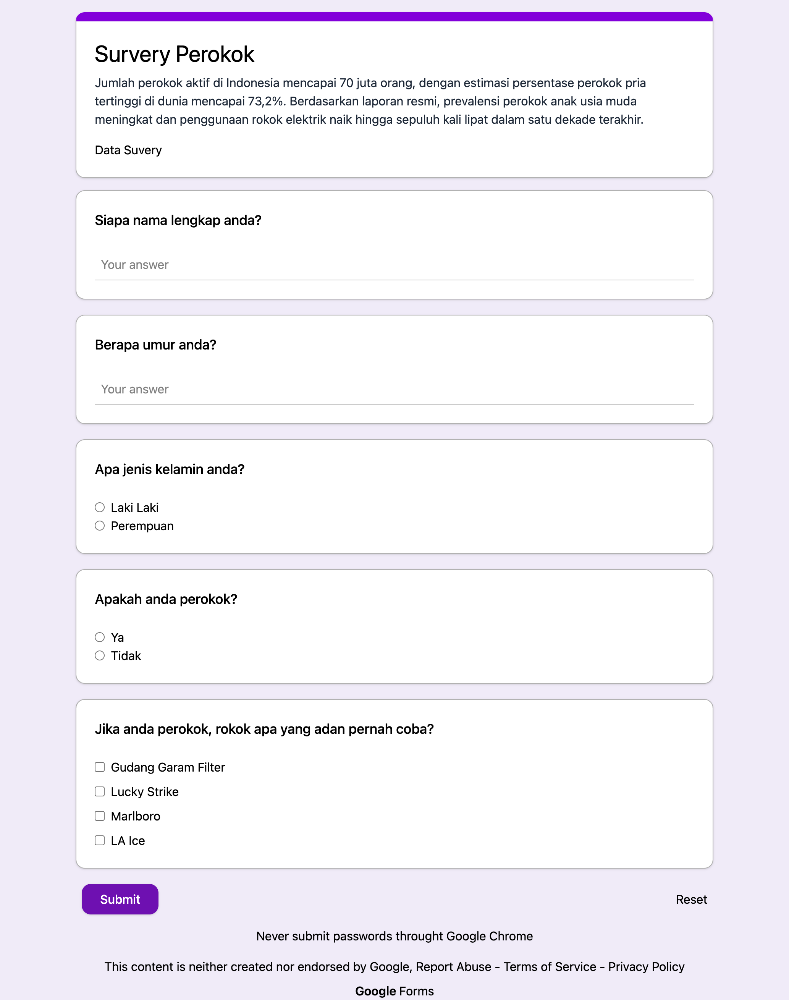
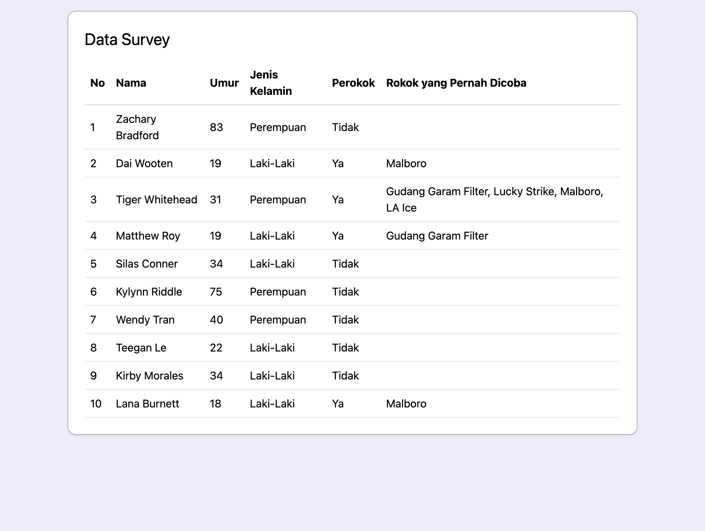

# Google Forms Clone

A simple Google Forms clone built with React and Vite. Users can fill out a survey form and view submitted survey results stored in Local Storage.


---

## Tech Stack

* React
* Vite
* React Hook Form
* Yup
* Tailwind CSS

---

## Routing
* `/survey` — The main form where users can fill out the survey.
* `/result-survey` — The page displaying the submitted responses.

## Screenshot

| Survey Form | Result Survey |
| :---: | :---: |
|  |  |

---

## Installation

```bash
git clone <https://github.com/zackyrafian/koda-b8-react5>
cd koda-b8-react5
npm install
npm run dev